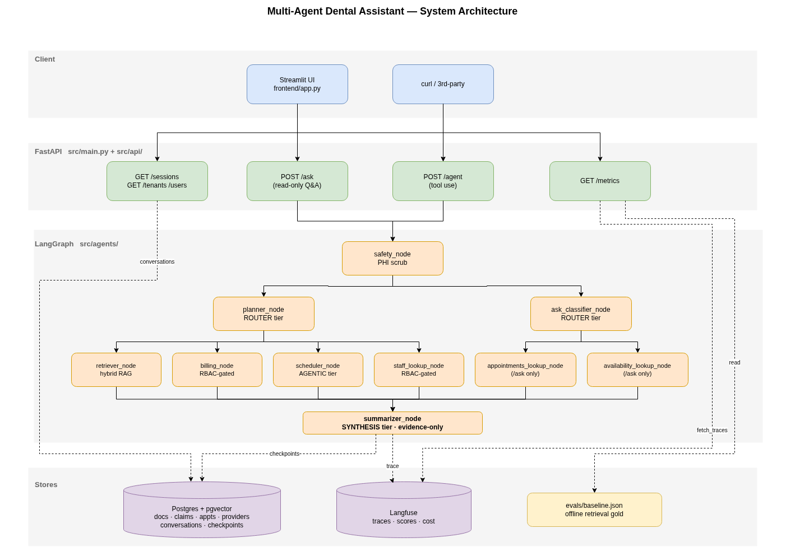
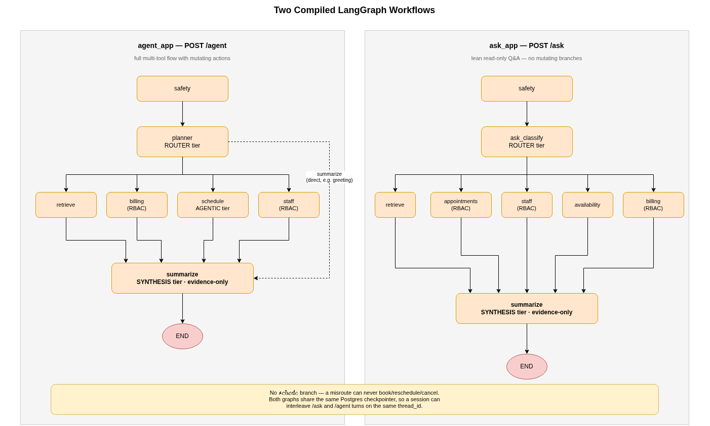
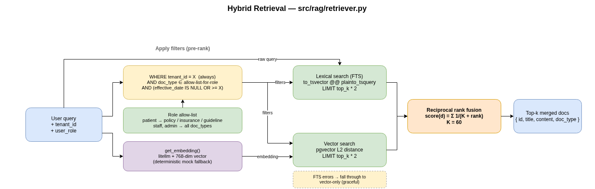
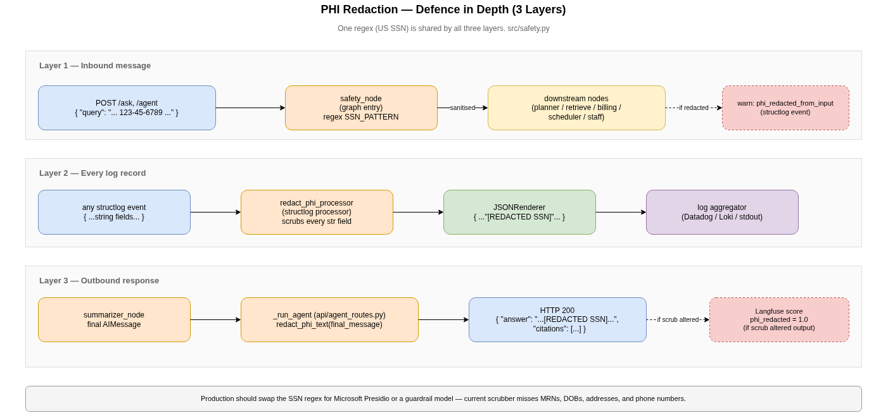
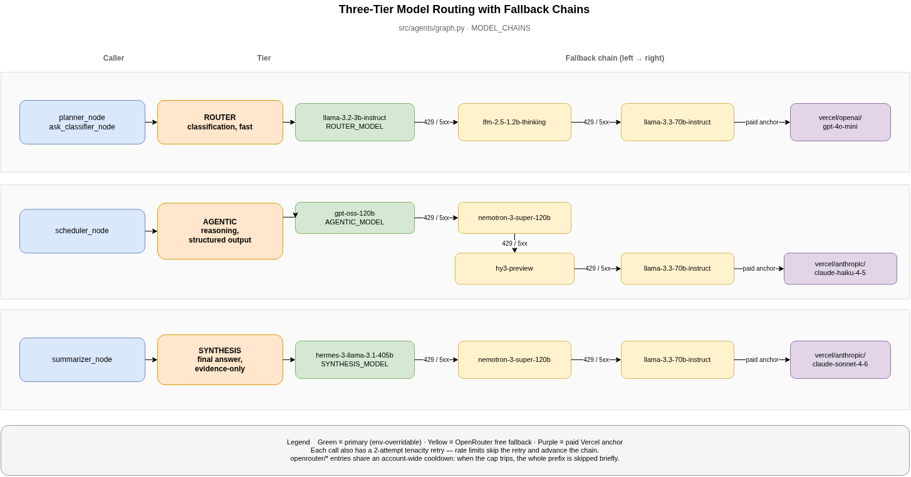
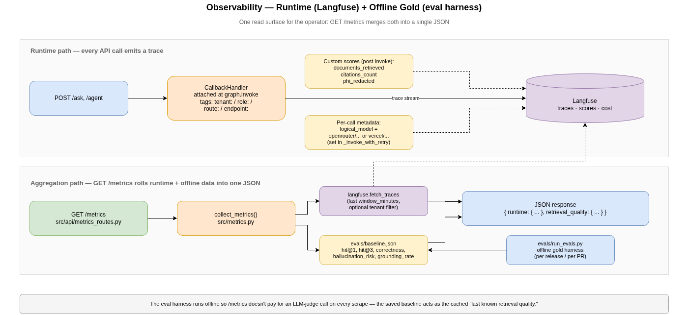

# Dental Practice Assistant: System Design

> All diagrams in this doc are auto-generated from [`diagrams/*.drawio`](diagrams/) sources. To regenerate the PNGs, run the docker command in [`diagrams/README.md`](diagrams/README.md).

## Architecture Overview



*Source: [`diagrams/architecture.drawio`](diagrams/architecture.drawio)*



*Source: [`diagrams/graphs.drawio`](diagrams/graphs.drawio)*

The system is built as a multi-agent orchestration service exposing an API.
- **Backend:** FastAPI for asynchronous, high-throughput endpoints (`/ask`, `/agent`) — see `src/main.py`.
- **Frontend:** Streamlit chat UI in `frontend/app.py` that calls the FastAPI endpoints. Lets the operator switch tenants, simulate patient/staff roles, and inspect citations + retrieval traces inline.
- **Database / Vector Store:** PostgreSQL with `pgvector` managed by SQLModel. This allows storing relational data (appointments, claims) and vector data (documents) in the same database, simplifying infrastructure while remaining production-grade.
- **Agent Orchestration:** LangGraph provides a deterministic state machine for agent workflows. `src/agents/graph.py` compiles two graphs against a shared `AgentState` and Postgres checkpointer:
  - `agent_app` (backs `POST /agent`): `Safety -> Planner -> (Retriever | Billing | Scheduler) -> Summarizer -> END` — full multi-tool flow, used when the request may need billing or scheduling.
  - `ask_app` (backs `POST /ask`): `Safety -> Retriever -> Summarizer -> END` — lean grounded-Q&A flow that skips the planner, drops the billing/scheduling tools, and is therefore one fewer LLM call, doc-grounded only, and incapable of mutating billing or scheduling state.
  Both graphs share the same checkpointer + state shape, so a session can interleave `/ask` and `/agent` turns on the same `thread_id` without losing history. In either flow the LLM cannot invoke an unplanned tool or loop.
- **LLM Integration:** LiteLLM is used as an abstraction layer so any provider can be plugged in. The defaults shipped in `.env.example` route to free-tier OpenRouter models (Llama 3.2/3.3, GPT-OSS, Hermes 3, Nemotron); embeddings default to `gemini/text-embedding-004` with a deterministic 768-dim mock fallback in `src/rag/embeddings.py` for offline/test runs.

## Retrieval Strategy (RAG Core)



*Source: [`diagrams/retrieval.drawio`](diagrams/retrieval.drawio)*
- **Hybrid Search:** `src/rag/retriever.py` runs two Postgres queries inside the same transaction — `pgvector` L2 distance for semantic similarity and `to_tsvector('english', content) @@ plainto_tsquery(...)` for lexical match — and merges them with reciprocal rank fusion (RRF) at `K=60`. Top-`k*2` candidates are pulled from each side so the fused list still has options even when one signal misses entirely.
- **Metadata Filters:** All three filters described in the requirements are applied *before* ranking: `tenant_id` (mandatory), `doc_type` (optional), and `effective_after` (optional, with `IS NULL OR effective_date >= X` so undated docs aren't dropped).
- **RBAC Retrieval Shaping:** The caller's `user_role` further narrows the doc_type set — `patient` callers can only see `policy`, `insurance`, `guideline`; `staff` and `admin` see everything. This is enforced inside the SQL `WHERE` clause, so the LLM never has the option of leaking a doc type the role isn't entitled to.
- **Evidence-First Prompting:** The summarizer is instructed to answer *only* from the scratchpad and to fall back to "I don't have enough information to answer that." when context is insufficient. Every final answer carries at least one citation — RAG paths cite document IDs, billing/scheduling paths cite claim/appointment IDs, and the tool-free greeting path uses an explicit "No external sources used" sentinel.
- **Embedding Resilience:** Embedding calls go through `litellm` wrapped in a tenacity retry (3 attempts, exponential backoff). On total failure the system falls back to a deterministic seeded 768-dim vector so seeding and offline development never block on a flaky model endpoint.

## Multi-Tenancy & Security Model



*Source: [`diagrams/phi-redaction.drawio`](diagrams/phi-redaction.drawio)*
- **Isolation:** Tenant IDs are required on every `/ask` and `/agent` request. DB schemas enforce foreign keys on `tenant_id`. All read operations (`retriever.py`, `tools/billing.py`, `tools/scheduler.py`) filter by `tenant_id`.
- **PHI Redaction (defence in depth, three layers):**
  1. The LangGraph `safety` node is the graph entry point and rewrites the latest user message with SSN-shaped substrings replaced by `[REDACTED SSN]` before any other node sees it.
  2. A `redact_phi` structlog processor scrubs the same patterns from every log record so PHI can't leak via the request log pipeline.
  3. The FastAPI handler scrubs the final answer one more time before returning it to the client.
- **Authenticated Identity for Tools:** The `billing_node` queries by the `patient_id` from the request state, never from text in the prompt — this prevents one patient from spoofing another's ID via the message body.
- **RBAC:** The system understands `user_role` (patient vs. staff). The `billing_node` denies access entirely if the role is anything other than `patient` or `staff`, even within the correct tenant.

## Model Routing Strategy



*Source: [`diagrams/model-tiers.drawio`](diagrams/model-tiers.drawio)*

LLM calls are split across three tiers based on task complexity and known model strengths. Each tier has a primary model and a fallback chain — if the primary fails (rate limit, timeout, API error), the system retries with the next model in the chain automatically.

All models are sourced from [OpenRouter free tier](https://openrouter.ai/models?q=free) and verified free as of 2026-04-29.

### Tiers

| Tier | Used By | Primary Model | Strength |
|---|---|---|---|
| `ROUTER` | `planner_node` | `meta-llama/llama-3.2-3b-instruct:free` | Lightweight, fast classification — 3B params, 131K context |
| `AGENTIC` | `scheduler_node` | `openai/gpt-oss-120b:free` | Reasoning + structured output for tool-use decisions — 120B MoE, tool calling |
| `SYNTHESIS` | `summarizer_node` | `nousresearch/hermes-3-llama-3.1-405b:free` | High-quality final response generation — 405B, 131K context |

### Fallback Chains

```
ROUTER:    llama-3.2-3b-instruct:free
           → lfm-2.5-1.2b-thinking:free
           → llama-3.3-70b-instruct:free

AGENTIC:   gpt-oss-120b:free
           → nemotron-3-super-120b-a12b:free
           → hy3-preview:free
           → llama-3.3-70b-instruct:free

SYNTHESIS: hermes-3-llama-3.1-405b:free
           → nemotron-3-super-120b-a12b:free
           → llama-3.3-70b-instruct:free
```

### Configuration

Override the primary model for any tier via environment variables without touching code:

```
ROUTER_MODEL=openrouter/meta-llama/llama-3.2-3b-instruct:free
AGENTIC_MODEL=openrouter/openai/gpt-oss-120b:free
SYNTHESIS_MODEL=openrouter/nousresearch/hermes-3-llama-3.1-405b:free
```

Fallback models in each chain are hardcoded and are not overridable by env — they act as a safety net.

### Per-Call Resilience
On top of the fallback chain, each individual model invocation is wrapped in a tenacity retry (2 attempts, exponential backoff) to absorb transient network/rate-limit errors before falling through to the next model in the chain. If every model in the chain fails, the system returns a generic apology rather than a 500.

### LLMOps & Observability



*Source: [`diagrams/observability.drawio`](diagrams/observability.drawio)*

The split is **runtime → Langfuse, ground-truth quality → eval harness, single read surface → `GET /metrics`.** Langfuse stores the trace stream produced by every API call; `/metrics` proxies a recent window of those traces into a simple JSON rollup so an operator (or a Prometheus scraper, with a small adapter) can read req counts, p95 latency, error rate, tokens/cost, and our custom RAG/PHI scores without opening the Langfuse UI. Real `hit@k` is intentionally NOT computed at runtime — it needs gold labels — so `/metrics` ALSO surfaces the most recent saved `evals/baseline.json` summary as `retrieval_quality`.

**Runtime observability (Langfuse):** A `langfuse.callback.CallbackHandler` is attached to every graph invocation in `src/main.py`. Out of the box this gives:

| Metric | Source |
|---|---|
| End-to-end trace latency | `trace.latency` |
| Per-LLM-call latency (planner / scheduler / summarizer) | `observation.latency` per node |
| Tokens (prompt / completion) | LiteLLM usage forwarded by the handler |
| Cost (USD) | Computed by Langfuse from token + model |
| Error / success per call | Trace status |
| Trace replay (full prompt + completion) | Langfuse trace UI |
| Per-tenant filtering | Trace tags `tenant:<id>` and `role:<role>` set in the handler |
| Per-route filtering | Trace tag `route:<retrieve|billing|schedule|summarize>` |

**Custom Langfuse scores** are pushed onto every trace after `agent_app.invoke()` finishes:

| Score | Meaning |
|---|---|
| `documents_retrieved` | Number of doc citations on the response (RAG depth proxy) |
| `citations_count` | Total citations of any kind on the response |
| `phi_redacted` | 1.0 if the output filter altered the final answer, else 0.0 |

These are filterable in the Langfuse UI alongside latency/cost so you can chart, e.g., "p95 latency for /agent calls where `documents_retrieved >= 2`."

**`GET /metrics` (operator rollup).** A FastAPI handler at `src/main.py:metrics` calls into `src/metrics.py:collect_metrics`, which:
1. Pulls the last `window_minutes` (default 60, max 1440) of traces from Langfuse via `fetch_traces(...)`, optionally filtered by a `tenant_id` tag.
2. Rolls them up into request count, by-route / by-role counters, latency p50/p95/p99/max, error rate, prompt/completion/total tokens, total cost, and the three custom-score averages above.
3. Loads `evals/baseline.json` (the most recent saved eval-harness run) and exposes its `hit@1`, `hit@3`, `correctness`, `hallucination_risk`, and `grounding_rate` as `retrieval_quality`.

`/metrics` is operator JSON, not Prometheus text — but the shape is intentionally Prometheus-friendly (counters + histograms) so a tiny adapter could serve `/metrics?format=prom` later without touching the aggregator. When Langfuse keys aren't configured (`LANGFUSE_PUBLIC_KEY` empty) the runtime block degrades to all-zero counts and the endpoint still responds 200, so local dev stays usable.

**Structured logging:** `structlog` emits a JSON line per HTTP request with the `redact_phi_processor` stripping SSN-shaped values. This is for log aggregation (Datadog, Loki, etc.) — Langfuse is not a log sink.

**What is NOT in Langfuse — and lives in the eval harness instead:** real retrieval quality (`hit@1`, `hit@3`), correctness vs an expected answer, and hallucination rate. These all require gold labels and so are computed offline by `evals/run_evals.py`. See "Evaluation" below.

### CI/CD & Rollback Plan
- **CI ([`.github/workflows/ci.yml`](../.github/workflows/ci.yml)):** Two jobs run on every push and PR.
  - `unit-tests` — spins up a `pgvector/pgvector:pg16` service container, installs `requirements.txt`, runs `pytest tests/` with **no LLM keys configured**. Unit tests deliberately don't hit a network — caching, RBAC routing, redaction, retrieval shape, and metrics aggregation are all exercised against stubs / a real DB.
  - `integration-redteam` — depends on `unit-tests`, brings up the API against pgvector, seeds the DB, and runs `evals/red_team.py`. Gated on `OPENROUTER_API_KEY` being set as a repo secret; on forks (or with no secret) it skips cleanly so the unit-test job still gates merges.

  The unit-test gate is **never** skipped, and the red-team job becomes a hard gate as soon as a maintainer adds the secret. This keeps CI fast and free for contributors while still letting maintainers block PRs that regress security behaviour.
- **CD:** The Dockerfile in the repo root produces a single image used by the API and the Streamlit frontend. `docker compose up --build` brings up Postgres + API + frontend with one command (the `api` service runs the seed script before serving traffic, so a fresh deploy is never empty).
- **Caching ([`src/agents/graph.py`](../src/agents/graph.py)):** Per-tier in-memory TTL+LRU cache (default 256 entries) wrapped around `get_llm_response`. ROUTER 5 min (classifications are stable), SYNTHESIS 60 s (absorbs retries / re-asks), AGENTIC disabled (its prompts include the patient's live appointment list — caching would mask state drift). All TTLs are env-overridable (`LLM_CACHE_TTL_*_S`). Hits are logged as `llm_cache_hit` so cache effectiveness is visible in the structlog stream.
- **Model rollback (no code change required):** The three primary models are env-driven (`ROUTER_MODEL`, `AGENTIC_MODEL`, `SYNTHESIS_MODEL`). To roll back a regressed model, edit `.env` and restart the container — the old version is one redeploy away. The hardcoded fallback chain in `MODEL_CHAINS` provides automatic in-flight rollback per call: a 5xx or rate-limit on the primary advances to the next model in the same tier, no human in the loop.
- **Code rollback:** Tag every deployable build (`vYYYY.MM.DD-N`); rolling back is `docker compose pull && docker compose up -d` against the previous tag. State is in Postgres, which is migration-managed by `init_db()` (idempotent table creation + `CREATE EXTENSION IF NOT EXISTS vector`).
- **Monitoring SLOs:** Two SLOs worth alerting on, both available in Langfuse and surfaced on `/metrics`: (a) `/agent` trace p95 latency > 5s over 5 min, and (b) trace error rate > 5% over 5 min (signals a primary-model outage; the in-tier fallback chain absorbs single-model failures, so a sustained error rate means *all* models in a tier are down).

## Evaluation

The eval harness in `evals/run_evals.py` is the offline complement to Langfuse — it computes the metrics that need labels and can't be derived from runtime traffic alone.

### Metrics (per question + aggregate)

| Metric | What it measures | How |
|---|---|---|
| `hit_at_1`, `hit_at_3` | **Real retrieval quality.** Did the gold-relevant doc appear in the top-1 / top-3 retrieved? | Each gold-set entry has a `relevant_doc_ids` list (e.g. `["doc_1"]`). The harness parses doc IDs from the API's `citations` field and intersects with the gold set. Aggregated as fraction across the suite. |
| `correctness` | Does the answer match the expected reply? | LLM-as-judge (Gemini 1.5 Flash), 0..1 |
| `hallucination_risk` | Does the answer assert claims not in the cited context? | LLM-as-judge sees only the retrieved context + citations + answer, scores 0..1 |
| `grounding_rate` | Fraction of answers with ≥1 citation | Direct count |
| `latency_s` | Wall-clock seconds for the API call | Local timing |
| `judge_cost_usd` | Approximate USD cost of the judge calls | `litellm.completion_cost` |

### Run modes

```
python -m evals.run_evals                      # one-off
python -m evals.run_evals --save baseline.json # snapshot a baseline
python -m evals.run_evals --baseline baseline.json  # diff a candidate vs baseline
```

The diff prints per-question deltas across `hit@1`, `hit@3`, `correctness`, `hallucination_risk`, and `latency_s`, marking changed rows with `*` so regressions are obvious in a CI log.

### Red-Team Pack (`evals/red_team.py`)
Five scenarios documented in `docs/prompts.md` — cross-tenant data access, PHI leakage, RBAC privilege escalation, prompt-injection instruction override, and prompt-injection tool-arg tampering.

## Trade-offs
- **Postgres over Chroma:** Chose PostgreSQL (`pgvector`) because we needed to store relational mock data (claims, appointments) alongside vectors. Using one DB reduces operational complexity over managing both Postgres and Chroma.
- **Prompt-Templated Scheduling:** The scheduler node supports check / book / reschedule / cancel by asking the AGENTIC-tier model to emit a constrained `ACTION:` / `PROVIDER:` / `DATETIME:` block, which is then parsed with regex. This is intentionally simpler than full tool-calling JSON schemas — it's appropriate for a prototype but would be replaced by structured tool calls or a real calendar-sync integration in production.
- **Regex-only PHI Redaction:** The current PHI scrubber matches SSN patterns only. The roadmap calls for swapping in Microsoft Presidio (or a guardrail model) for full PII coverage.
- **`/metrics` reads from Langfuse rather than a parallel collector:** We considered running Prometheus alongside Langfuse and decided against it — every counter the brief asked for (req count, latency p95, error rate, tokens, cost) is already emitted by the per-request `CallbackHandler`, so a parallel collector would just be a second source of truth. The trade-off is that `/metrics` is only as fresh as the trace ingestion lag (single-digit seconds in practice) and does cost a Langfuse `fetch_traces` call per scrape. For a prototype that's a worthwhile simplification; for a high-scrape-rate production deployment we'd front this with a 30 s in-process cache.
- **In-memory LLM cache, not Redis:** Caching is per-process and dies on restart. That's deliberate — for this prototype's traffic shape (single API container, low QPS), Redis would add an operational dependency for almost no win. If we horizontally scale the API, the cache becomes a Redis hash keyed on the same `(tier, sha1(messages))` and the rest of the code is unchanged.
