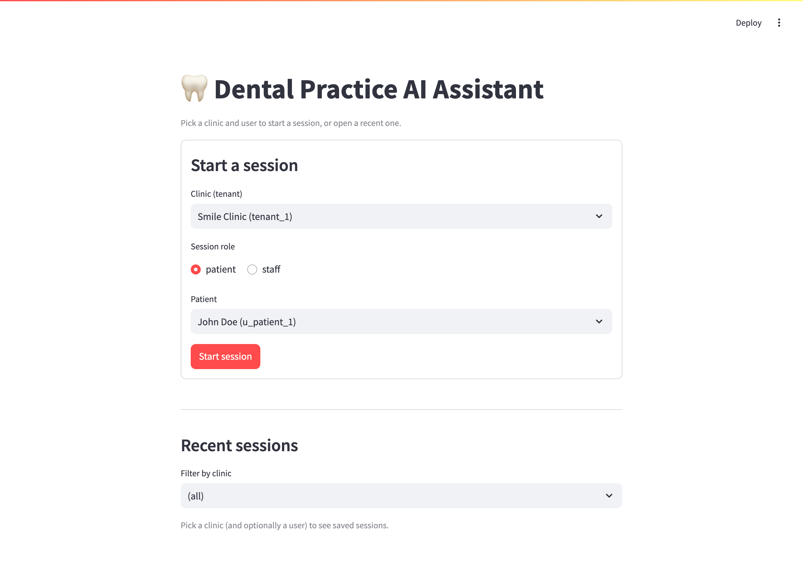
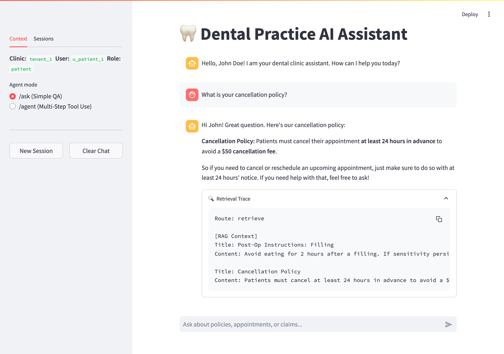
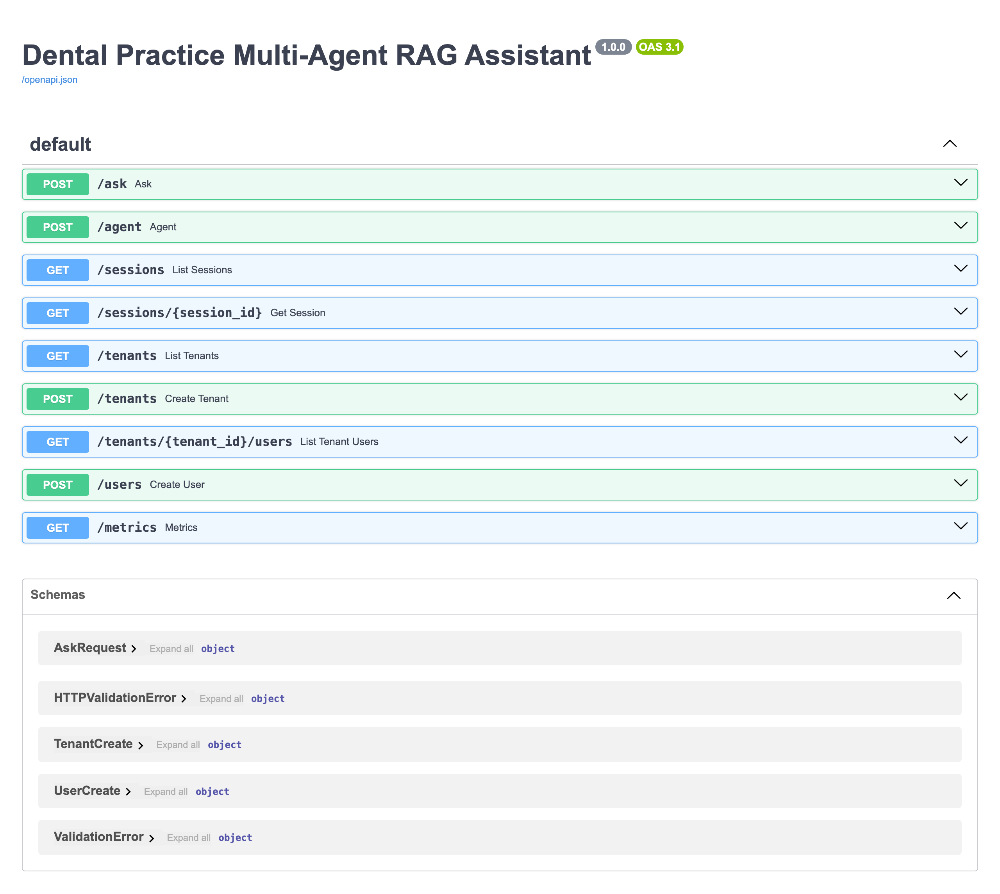
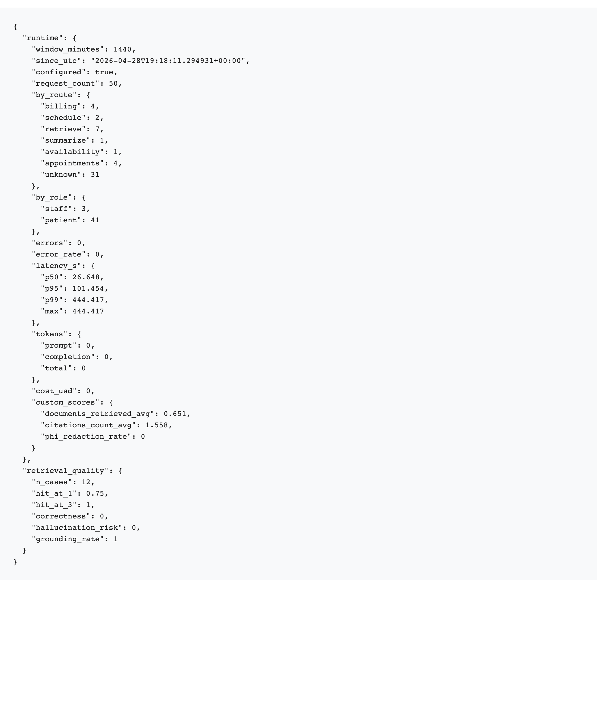
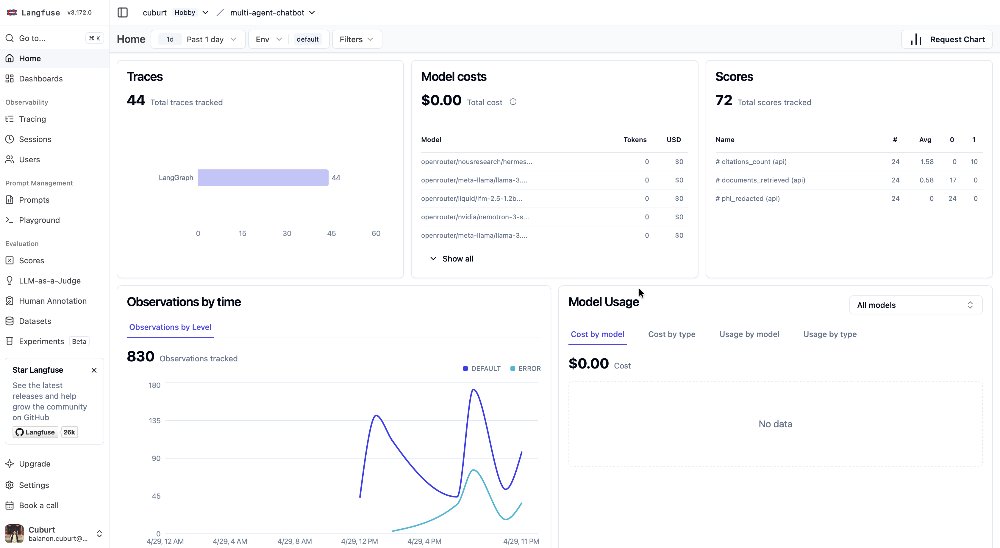
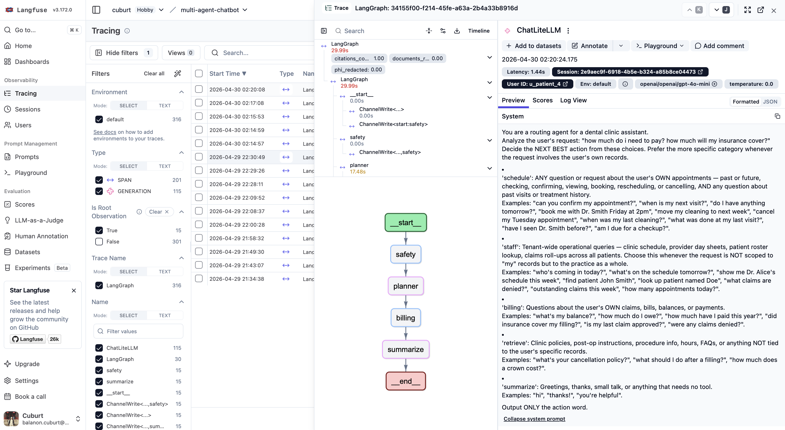
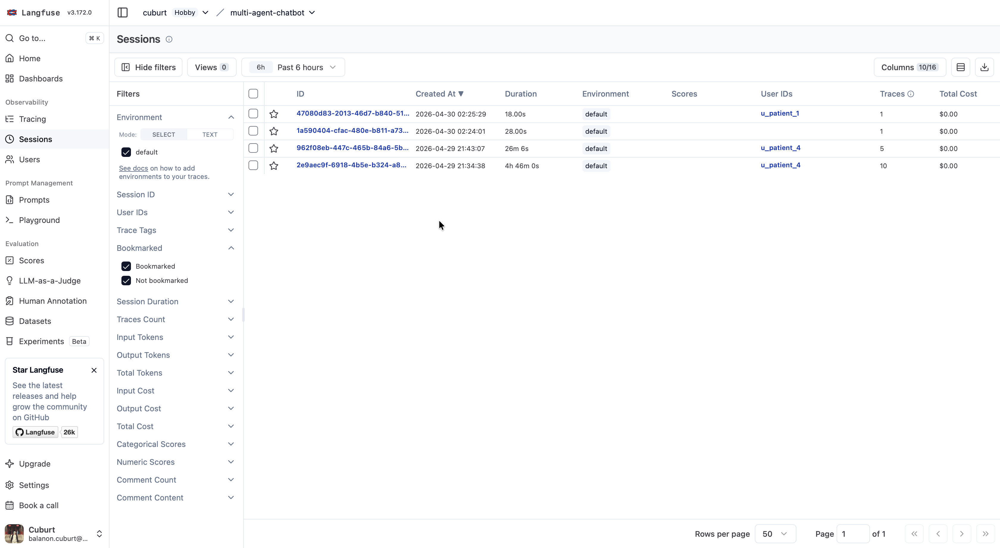
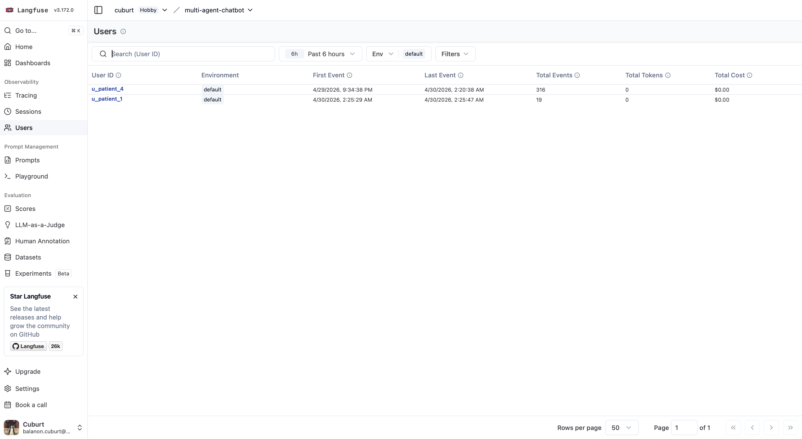

# Executive Readout: Multi-Agent Dental Assistant

A grounded, multi-tenant assistant for a dental-practice platform. Two `POST` endpoints
(`/ask`, `/agent`) serve patients and staff over a shared LangGraph state machine, every
read is hard-pinned by `tenant_id`, every answer carries citations, and PHI never makes
it into a log line or response.

---

## 1. Architecture at a Glance


*Source: [`diagrams/architecture.drawio`](diagrams/architecture.drawio) — open at <https://app.diagrams.net> to edit.*

Two graphs share the same Postgres checkpointer and `AgentState` shape:

| Endpoint | Path | Why |
|---|---|---|
| `POST /ask` | safety → ask_classify → (retrieve \| appointments \| availability \| billing \| staff) → summarize | Read-only. Tighter SLO, smaller failure surface, can never mutate scheduling/billing state. |
| `POST /agent` | safety → planner → (retrieve \| billing \| schedule \| staff) → summarize | Full tool-use, including book/reschedule/cancel mutations. |

A session can interleave the two endpoints freely on the same `thread_id`.


*Source: [`diagrams/graphs.drawio`](diagrams/graphs.drawio).*

### Live surfaces

The Streamlit operator UI starts each session by picking a tenant, role, and
user — the role drives both the user list and what the backend will allow
the session to do.



Once a session is open, the chat view shows answers with their citations and
an expandable retrieval trace. Every assistant turn carries the route the
graph took, the documents pulled by the RAG node, and the scratchpad that
became the LLM's grounding context.



The same `/ask` and `/agent` endpoints are usable directly from any HTTP
client. FastAPI's auto-generated Swagger UI at `/docs` lists every route
and its request schema, including the directory CRUD that backs the setup
form above.



---

## 2. Key Technical Decisions

1. **One database stack (Postgres + `pgvector`).** Relational tables (appointments, claims,
   providers, conversations) live next to vector embeddings. Halves the operational
   surface area vs. running Chroma + Postgres, and lets `JOIN`s line up tenant filters
   with vector search.
2. **LangGraph over free-form ReAct.** A deterministic state machine means the LLM
   *cannot* invoke an unplanned tool, recurse, or mutate state outside an authorized
   node. RBAC is enforced *inside* the node, before the tool runs.
3. **Hard tenant isolation in SQL, not in the prompt.** `WHERE tenant_id = X` is the
   first filter on every read in `retriever.py`, `tools/billing.py`, `tools/scheduler.py`,
   and `tools/staff.py`. The LLM never sees another tenant's data, so it can't leak it.
4. **Three-tier model routing with hardcoded fallbacks.** ROUTER (3B), AGENTIC (120B),
   SYNTHESIS (405B). Primary models are env-overridable for rollback; the fallback
   chain absorbs single-model 5xx/rate-limits without operator intervention. A paid
   Vercel AI Gateway model anchors each chain so the system stays up when free-tier
   providers cap.
5. **Three-layer PHI defence.** safety_node scrubs the inbound message →
   `redact_phi` structlog processor scrubs every log record → FastAPI handler
   scrubs the final answer. Defence in depth, not "the LLM promised."

---

## 3. Metrics & Evaluation

We split **runtime quality** (Langfuse) from **gold-labelled quality** (offline evals).

### 3a. Runtime — `GET /metrics`

Returns a JSON rollup of the last `window_minutes` (default 60) of traces from
Langfuse, plus the most recent saved eval baseline.

```bash
curl 'http://localhost:8000/metrics?window_minutes=60' | jq
```

Shape:

```json
{
  "runtime": {
    "window_minutes": 60,
    "request_count": 42,
    "by_route":   {"retrieve": 18, "billing": 7, "schedule": 9, "staff": 5, "summarize": 3},
    "by_role":    {"patient": 31, "staff": 11},
    "errors": 1,
    "error_rate": 0.024,
    "latency_s": {"p50": 1.42, "p95": 3.89, "p99": 5.10, "max": 6.20},
    "tokens":    {"prompt": 28430, "completion": 9214, "total": 37644},
    "cost_usd":  0.0184,
    "custom_scores": {
      "documents_retrieved_avg": 1.9,
      "citations_count_avg": 2.4,
      "phi_redaction_rate": 0.05
    }
  },
  "retrieval_quality": {
    "n_cases": 13, "hit_at_1": 1.0, "hit_at_3": 1.0,
    "correctness": 0.96, "hallucination_risk": 0.02, "grounding_rate": 1.0
  }
}
```

Why this shape: req counts + latency percentiles + error rate are exactly what the
brief asked the `/metrics` endpoint to expose, and we avoid a parallel Prometheus
collector by reading the same trace stream Langfuse already stores.

A live response from a local stack with 50 recent calls and a saved eval
baseline looks like this:



The same trace stream is browsable directly in Langfuse. The home dashboard
rolls up traces, costs, and our three custom scores
(`citations_count`, `documents_retrieved`, `phi_redacted`) — these are what
`/metrics` aggregates into `custom_scores`:



Each request is one trace, and the trace view shows every node the graph
ran with its own latency and the prompt that went into it. Useful when a
specific answer was off and you want to see the planner's exact decision:



The `session_id` carried on every API call groups multi-turn conversations
together. Filtering Sessions by user_id is what powers the sidebar in the
Streamlit UI's "Sessions" tab:



Per-user rollup — total events, tokens, and cost. Useful for spotting one
user driving disproportionate spend, and the `user_id` here is the same
authenticated `patient_id` we bind tool args to:



### 3b. Offline — `evals/run_evals.py`

13-case gold set covering RAG retrieval, patient appointments, billing, availability,
and three staff roll-ups. Per-case metrics: `hit@1`, `hit@3`, `route_correct`,
`correctness` (LLM-judge), `hallucination_risk` (LLM-judge), `grounding_rate`,
`latency_s`, `judge_cost_usd`.

```
python -m evals.run_evals --save baseline.json
python -m evals.run_evals --baseline baseline.json   # diff vs saved run
```

A representative summary line from a saved run looks like:

```
--- Eval Summary ---
  n: 13
  hit_at_1: 1.0   hit_at_3: 1.0   n_rag_cases: 4
  route_accuracy: 1.0   n_routed_cases: 13
  avg_correctness: 0.96   avg_hallucination_risk: 0.02
  grounding_rate: 1.0     avg_latency_s: 1.74
  total_judge_cost_usd: 0.0011
```

The diff path prints per-question deltas with a `*` marker on rows that move ≥0.05
on any metric or flip routing — designed to show up as red in a CI log.

### 3c. Sample log & trace

Every HTTP request emits a single structlog JSON line with PHI scrubbed:

```json
{"event": "request_processed", "path": "/ask", "method": "POST",
 "status_code": 200, "latency_ms": 1834.21,
 "level": "info", "timestamp": "2026-04-30T14:02:11.483Z"}
{"event": "phi_redacted_from_input", "tenant_id": "tenant_1",
 "level": "warning", "timestamp": "2026-04-30T14:02:11.501Z"}
```

The Langfuse trace for the same request carries:
- `tags`: `tenant:tenant_1`, `role:patient`, `endpoint:ask`, `route:retrieve`
- per-node observations (planner / retriever / summarizer) with their own latencies
- custom scores: `documents_retrieved=2`, `citations_count=2`, `phi_redacted=0`

The `route:` and `endpoint:` tags are what `/metrics` reads to roll up by-route counts.

---


*Source: [`diagrams/observability.drawio`](diagrams/observability.drawio).*

---

## 4. Safety Posture

| Threat | Control | Where it lives |
|---|---|---|
| Cross-tenant read | `WHERE tenant_id = :tid` on every SQL query | `src/rag/retriever.py`, `src/tools/*.py` |
| Cross-patient billing/appt access | Tool args bound to authenticated `state["patient_id"]`, never parsed from the prompt | `src/agents/graph.py` (billing_node, appointments_lookup_node) |
| Privilege escalation (patient → staff tools) | `staff_lookup_node` hard-denies non-staff roles before any read | `src/agents/graph.py:staff_lookup_node` |
| PHI in logs / outputs | regex SSN scrubber at three points (input, log processor, output) | `src/safety.py`, `src/main.py` |
| Prompt-injection instruction override | Evidence-first summariser prompt + filters enforced *outside* the LLM | `src/agents/prompts.py:SUMMARIZER_PROMPT`, SQL filters |
| Session hijack via thread_id guess | `_assert_session_owner` rejects mismatched (tenant, user) on every turn | `src/main.py:_assert_session_owner` |

Ten red-team scenarios in [`evals/red_team.py`](../evals/red_team.py) exercise all six
controls and run against a live API.


*Source: [`diagrams/phi-redaction.drawio`](diagrams/phi-redaction.drawio).*

---

## 5. LLMOps

- **CI/CD:** [`.github/workflows/ci.yml`](../.github/workflows/ci.yml) automates the entire lifecycle:
  - **Test:** Unit tests + gated red-team pack.
  - **Release:** Image push to Docker Hub.
  - **Deploy:** Automated Google Cloud Run deployment.
  - **Auto-Seed:** Container seeds Cloud SQL on startup.
- **Caching:** Per-tier in-memory TTL cache (`src/agents/graph.py`). ROUTER 5 min,
  SYNTHESIS 60 s, AGENTIC disabled (its prompts include live appointment state). Sized
  to 256 entries with LRU eviction. TTLs are env-overridable.
- **Rollback:**
  - *Model:* primary per tier is env-driven (`ROUTER_MODEL`, `AGENTIC_MODEL`,
    `SYNTHESIS_MODEL`); change `.env` and restart.
  - *Code:* every deploy is a tagged image; `docker compose pull && up -d` against the
    previous tag.
  - *In-flight:* automatic — a 5xx or rate-limit on the primary trips the next entry in
    the same tier's chain, no human in the loop.
- **SLOs (alert in Langfuse):** `/agent` p95 > 5 s for 5 min; trace error rate > 5 %
  for 5 min (signals a primary-model outage; in-tier fallback absorbs single-model
  failures, so a sustained error rate means *all* models in a tier are down).

---

## 6. Roadmap

| Priority | Item | Why |
|---|---|---|
| P0 | Replace SSN-only regex with **Microsoft Presidio** | Current scrubber misses MRNs, DOBs, addresses, phone numbers — full PII coverage required for HIPAA-aligned production. |
| P0 | **Structured tool calls** for the scheduler (replace regex `ACTION:` parsing) | Regex is fragile to model wording drift; OpenAI/Anthropic-style JSON tool schemas are stricter and self-documenting. |
| P1 | **Calendar sync** integration (Google / iCal / Athena) | Drafted appointments are local-only today; production needs writeback to the practice's source-of-truth scheduler. |
| P1 | **Authn/Z** — replace `patient_id`-in-body with JWT auth | The current model trusts the caller to set their own `patient_id`; production needs an issuer-signed token. |
| P2 | **Per-tenant retrieval re-ranker** | The hybrid RRF works on five docs but won't scale to thousands per tenant. Start with a tenant-scoped Cohere/BGE re-ranker as a third pass. |
| P2 | **Evals on every PR** with a regression gate | The harness exists but isn't gated yet — adding a `correctness >= baseline - 5%` gate to CI would catch quality regressions automatically. |
| P3 | **Patient-facing channel** (SMS / WhatsApp / web widget) | The Streamlit UI is operator-grade; production needs a low-friction patient surface that calls `/ask` and `/agent` over a thin gateway. |
